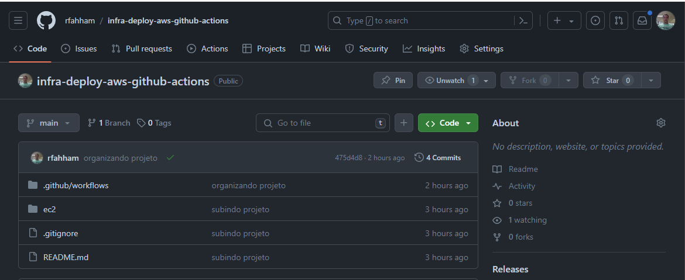
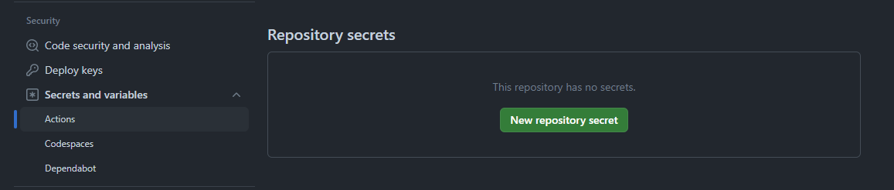
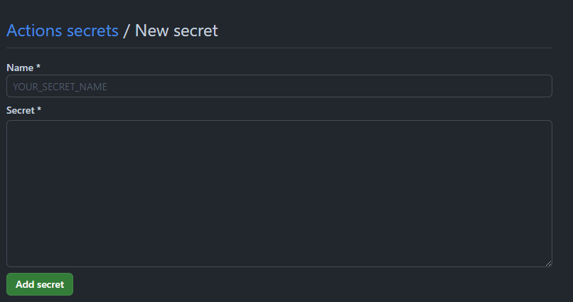
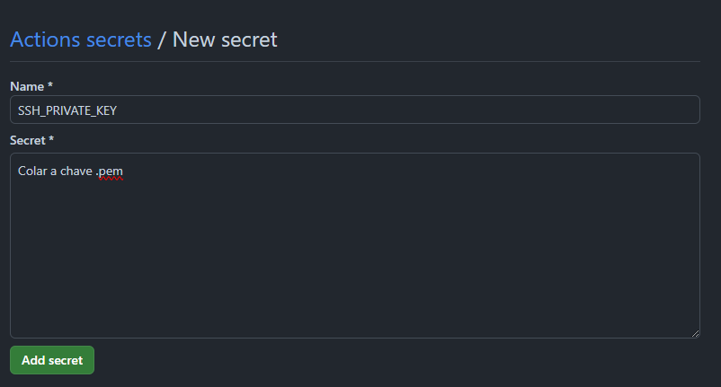
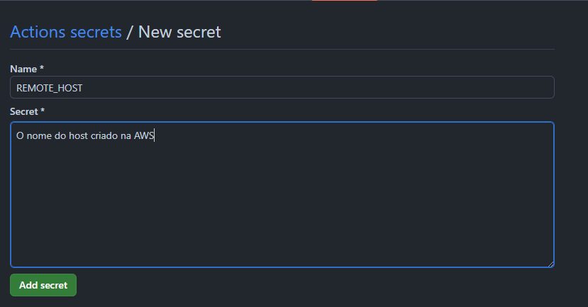
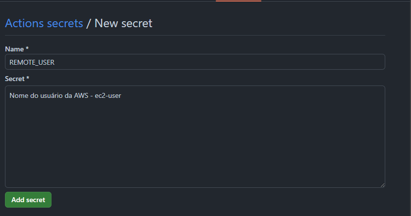
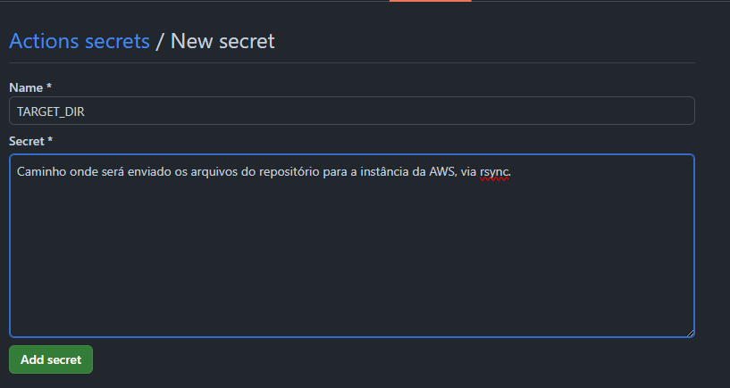
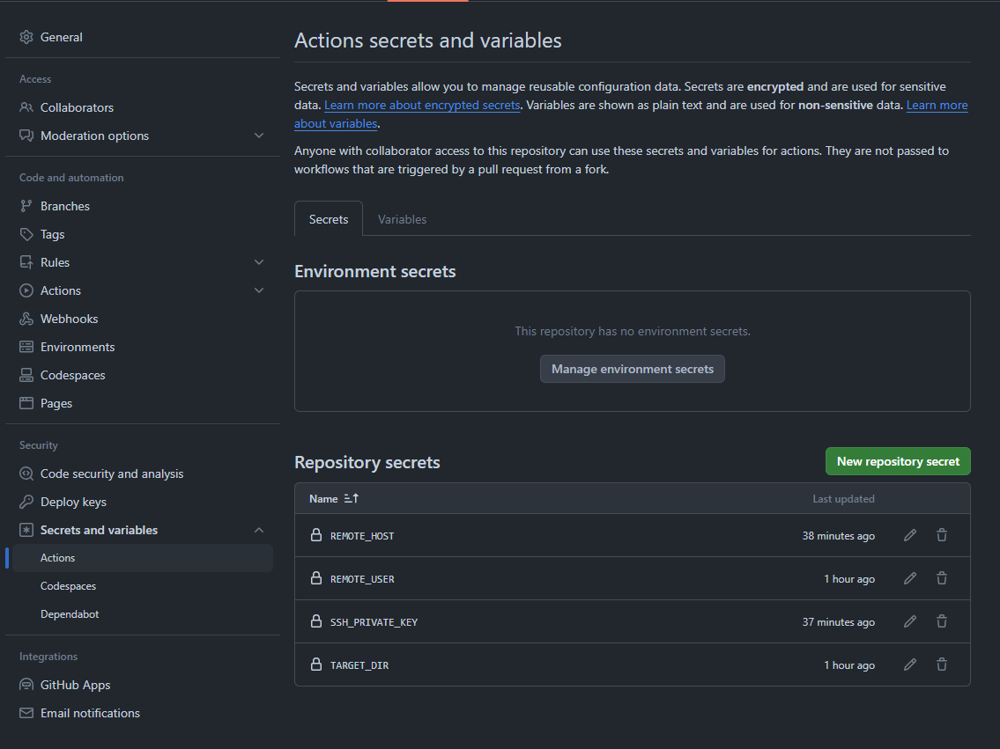

# Configuração do Github-Actions

## Criação das Secrets

Por questão de segurança é fortemente recomendado o uso de secrets para o projeto.

## No caso deste projeto foram usados:

    SSH_PRIVATE_KEY: ${{secrets.SSH_PRIVATE_KEY}}
    REMOTE_HOST: ${{secrets.REMOTE_HOST}}
    REMOTE_USER: ${{secrets.REMOTE_USER}}
    TARGET: ${{secrets.TARGET_DIR}}

## As secrets poderão ser definidas acessando `settings`.

Clicar em Secrets and variables

Depois em Actions

Adicionar as Secrests, clicando em `New repository secret`.

Agora basta adicionar as secrets, com chave e o valor correspondente

Chave privada, .pem que foi criada na criação da instância

Nome do Host da AWS

Nome do usuário da AWS

Caminho para onde será enviado os arquivos

Todas as secrets configuradas

## JOB executado

https://github.com/rfahham/infra-deploy-aws-github-actions/actions/runs/8664288194